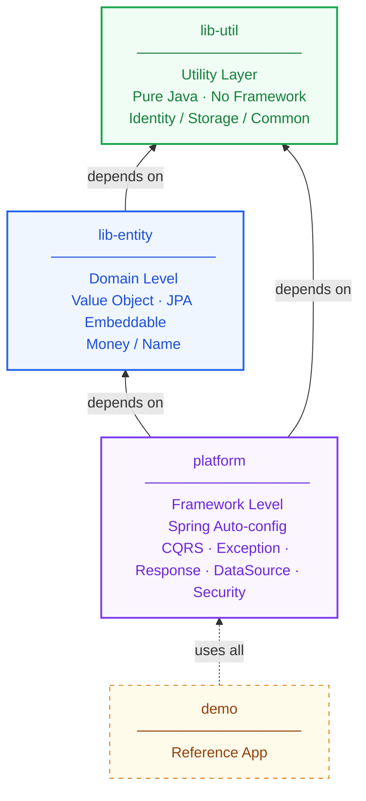

# base-kit

---

## 목차

1. [소개](#1-소개)
2. [요구사항](#2-요구사항)
3. [의존성 추가](#3-의존성-추가)
4. [모듈 구조](#4-모듈-구조)
5. [제공 기능](#5-제공-기능)
   - 5.1 [CQRS](#51-cqrs)
   - 5.2 [예외 처리](#52-예외-처리)
   - 5.3 [응답 형식](#53-응답-형식)
   - 5.4 [JPA 기반 엔티티](#54-jpa-기반-엔티티)
   - 5.5 [Read/Write DB 라우팅](#55-readwrite-db-라우팅)
   - 5.6 [CORS 설정](#56-cors-설정)
   - 5.7 [공통 Value Object](#57-공통-value-object)
6. [설정 레퍼런스](#6-설정-레퍼런스)
7. [배포](#7-배포)

---

## 1. 소개

### 1.1 설계 배경

**문제의식**: 프로젝트마다 반복되는 보일러플레이트 코드와 일관성 없는 설정으로 인해 개발 생산성이 저하되고, 유지보수가 파편화되는 문제를 해결하고자 합니다.

**필요성**: 스프링 프로젝트의 초기 설정 비용을 최소화하고, 공통 기능을 모듈화하여 비즈니스 로직에만 집중할 수 있는 환경을 구축합니다.

### 1.2 설계 의도

**일관성**: 어떤 개발자가 참여하더라도 동일한 인터페이스와 아키텍처 패턴을 유지하도록 가이드합니다.

**관심사 분리**: CORS, DB 라우팅, 예외 처리 등 인프라 성격의 공통 관심사를 모듈 레벨에서 추상화하여 개발자의 인지 부하를 줄입니다.

**확장성**: 강제적인 규격이 아닌, @Conditional 기반 설정을 통해 필요한 경우 사용자가 손쉽게 커스텀할 수 있는 유연함을 제공합니다.

### 1.3 핵심 목표

**생산성 향상**: 반복적이고 복잡한 스프링 부트 설정을 코드 한 줄 없이 자동화합니다.

**안정성 확보**: 검증된 공통 모듈 사용으로 런타임 에러를 줄이고 유지보수 비용을 절감합니다.

**표준화**: API 응답 포맷과 에러 코드를 표준화하여 프론트엔드 및 외부 시스템과의 협업 효율을 극대화합니다.

---

## 2. 요구사항

- Java 21
- Spring Boot 3.x

---

## 3. 의존성 추가

### 저장소 설정

GitHub Packages는 공개 저장소여도 읽기 인증이 필요합니다.

```groovy
repositories {
    mavenCentral()
    maven {
        url = uri('https://maven.pkg.github.com/yeongseoksong/base-kit')
        credentials {
            username = project.findProperty('gpr.user')?.toString() ?: System.getenv('GITHUB_ACTOR')
            password = project.findProperty('gpr.key')?.toString() ?: System.getenv('GITHUB_TOKEN')
        }
    }
}
```

**로컬 개발 환경** — `~/.gradle/gradle.properties` 또는 `~/.zshrc` 중 선택:

```properties
# ~/.gradle/gradle.properties
gpr.user=yeongseoksong
gpr.key=<GitHub Personal Access Token>  # read:packages 권한 필요
```

```bash
# ~/.zshrc
export GITHUB_ACTOR=yeongseoksong
export GITHUB_TOKEN=<GitHub Personal Access Token>
```

### 의존성 선언

```groovy
dependencies {
    // platform 하나로 lib-entity 포함
    implementation 'io.github.yeongseoksong:base-kit-platform:0.1.0'

    // Value Object만 별도로 필요한 경우
    implementation 'io.github.yeongseoksong:base-kit-lib-entity:0.1.0'

    // util만 필요한 경우
    implementation 'io.github.yeongseoksong:base-kit-lib-util:0.1.0'
}
```

---

## 4. 모듈 구조

```
base-kit/
├── platform/
├── lib-entity/
├── lib-util/
└── demo/
```

| 아티팩트 | artifactId | 설명 |
|---|---|---|
| platform | `base-kit-platform` | 본 프로젝트의 핵심 모듈로, 스프링(Security, JPA, MVC 등)의 Auto-configuration을 제공하여 보일러플레이트 코드를 제거하고 사용자에게 표준화된 인터페이스를 제공합니다. |
| lib-entity | `base-kit-lib-entity` | 도메인에서 공통으로 사용할 수 있는 Value Object(Money, Name 등)를 제공합니다. Jakarta Persistence API 표준 애노테이션을 내장하여, 서비스 엔티티에서 별도 정의 없이 @Embedded로 즉시 사용 가능합니다. |
| lib-util | `base-kit-lib-util` | 범용 유틸리티 및 기능 래퍼. 스프링/DB 의존성 없이 순수 자바 유틸리티(String, Date 등)와 외부 기능(UUID, S3 등)을 단순화된 함수 형태로 제공합니다. |
| demo | `demo` | base-kit의 모든 모듈을 통합하여 실제 동작을 검증하고, 개발자에게 베스트 프랙티스(Best Practice) 예제를 제공하는 레퍼런스 앱입니다. (배포 제외) |

### 의존성 설계 원칙

의존성은 항상 **상위 레벨 → 하위 레벨** 방향으로만 흐릅니다. 하위 모듈은 상위 모듈을 알지 못하며, 역방향 참조와 순환 참조가 구조적으로 불가능합니다.



**1. lib-util**

- **프레임워크 독립성**: 특정 프레임워크에 종속되지 않는 순수 자바(Pure Java) 기반의 도구 모음입니다.
- **기능별 래퍼 제공**: 비즈니스 로직에서 반복적으로 사용되는 핵심 기능들을 기능 단위로 래핑하여 제공합니다.
  - `Identity` — 서비스 표준에 맞춘 UUID 생성 및 검증
  - `Storage` — S3 등 외부 스토리지 조작을 단순화한 함수형 인터페이스
  - `Common` — String, Date, Collection 등 자바 표준 API의 안전한 확장
- **범용성**: 어떤 성격의 프로젝트(Spring, Batch, Library 등)에서도 부담 없이 도입할 수 있는 최하위 기초 모듈입니다.

**2. lib-entity** 

- **도메인 표준화**: Money, Name 등 전사적으로 공용하는 **Value Object(VO)**를 제공합니다.
- **영속성 규격 준수**: Jakarta Persistence API를 활용해 데이터베이스 매핑 규격을 내장하고 있으며, `lib-util`의 기능을 활용해 도메인의 제약 사항을 검증합니다.

**3. platform**

- **기능 통합**: `lib-util`과 `lib-entity`를 조합하여 실제 비즈니스 환경에 필요한 **설정**을 완성합니다.
- **보일러플레이트 제거**: 보안, API 응답, DB 라우팅 등 복잡한 스프링 설정을 추상화하여 제공합니다.


---

## 5. 제공 기능

### 5.1 CQRS

`CommandBus` / `QueryBus`를 통해 Command와 Query를 분리합니다.
Auto-configuration으로 자동 등록되며 `@ComponentScan` 수정이 불필요합니다.

```java
// Command 정의
public record CreateOrderCommand(String productId, int quantity) implements Command<Long> {}

// CommandHandler — WRITE DB 트랜잭션
@Component
@Transactional
public class CreateOrderCommandHandler implements CommandHandler<CreateOrderCommand, Long> {
    @Override
    public Long handle(CreateOrderCommand command) {
        return savedOrder.getId();
    }
}

// Query 정의
public record OrderQuery(Long orderId) implements Query<OrderResponse> {}

// QueryHandler — READ DB 자동 라우팅
@Component
@Transactional(readOnly = true)
public class OrderQueryHandler implements QueryHandler<OrderQuery, OrderResponse> {
    @Override
    public OrderResponse handle(OrderQuery query) {
        return orderRepository.findById(query.orderId());
    }
}

// Controller
@RestController
@RequiredArgsConstructor
public class OrderController {
    private final CommandBus commandBus;
    private final QueryBus queryBus;

    @PostMapping("/orders")
    public ApiResponse<Long> create(@RequestBody CreateOrderRequest request) {
        return ApiResponse.success(commandBus.dispatch(new CreateOrderCommand(request.productId(), request.quantity())));
    }

    @GetMapping("/orders/{id}")
    public ApiResponse<OrderResponse> get(@PathVariable Long id) {
        return ApiResponse.success(queryBus.dispatch(new OrderQuery(id)));
    }
}
```

---

### 5.2 예외 처리

`ErrorCode` 인터페이스를 서비스별 `enum`으로 구현합니다.
`GlobalExceptionHandler`가 `BusinessException`을 자동으로 `ErrorResponse`로 변환합니다.

```java
// 서비스별 ErrorCode 정의
@Getter
@RequiredArgsConstructor
public enum OrderErrorCode implements ErrorCode {
    ORDER_NOT_FOUND(404, "O001", "주문을 찾을 수 없습니다."),
    INSUFFICIENT_STOCK(400, "O002", "재고가 부족합니다.");

    private final int status;
    private final String code;
    private final String message;
}

// 사용
throw new BusinessException(OrderErrorCode.ORDER_NOT_FOUND);
```

**에러 응답 형식:**
```json
{
  "code": "O001",
  "message": "주문을 찾을 수 없습니다.",
  "errors": []
}
```

---

### 5.3 응답 형식

모든 API 응답은 `ApiResponse<T>`로 래핑합니다.

```java
// 단건 응답
return ApiResponse.success(orderResponse);

// 페이지 응답
Page<Order> page = orderRepository.findAll(pageable);
return ApiResponse.success(PageResponse.of(page.map(OrderResponse::from)));
```

**성공 응답 형식:**
```json
{
  "data": { ... }
}
```

**페이지 응답 형식:**
```json
{
  "data": {
    "content": [...],
    "page": 0,
    "size": 20,
    "totalElements": 100,
    "totalPages": 5,
    "last": false
  }
}
```

---

### 5.4 JPA 기반 엔티티

#### BaseEntity

생성/수정 시각과 생성/수정자를 자동 관리합니다.

```java
@Entity
public class Order extends BaseEntity {
    @Id @GeneratedValue
    private Long id;
    // createdAt, updatedAt, createdBy, updatedBy 자동 관리
}
```

> `createdBy` / `updatedBy` 사용 시 소비 서비스에서 `AuditorAware<String>` 빈 정의가 필요합니다.

#### BaseAggregateRoot

도메인 이벤트 발행이 필요한 Aggregate Root에 사용합니다.

```java
@Entity
public class Order extends BaseAggregateRoot<Order> {
    public void complete() {
        // 비즈니스 로직
        registerEvent(new OrderCompletedEvent(this.id));
    }
}
```

---

### 5.5 Read/Write DB 라우팅

`@Transactional(readOnly = true)` 여부에 따라 `RoutingDataSource`가 자동으로 READ/WRITE DB를 선택합니다.

`base-kit.datasource.enabled: false`가 기본값입니다. 활성화하려면 아래 설정을 추가하세요.

```yaml
base-kit:
  datasource:
    enabled: true
    write:
      url: jdbc:mysql://primary:3306/db
      username: root
      password: secret
      driver-class-name: com.mysql.cj.jdbc.Driver
      pool:
        maximum-pool-size: 10
        minimum-idle: 5
        connection-timeout: 3000
    read:
      url: jdbc:mysql://replica:3306/db
      username: root
      password: secret
      driver-class-name: com.mysql.cj.jdbc.Driver
      pool:
        maximum-pool-size: 20
        minimum-idle: 5
        connection-timeout: 3000
```

> `enabled: false`이면 기존 `spring.datasource` 설정을 그대로 사용합니다.

---

### 5.6 CORS 설정

```yaml
base-kit:
  cors:
    mapping: /api/**
    allowed-origins:
      - https://my-service.com
    allowed-credentials: true
```

---

### 5.7 공통 Value Object

`lib-entity` 모듈이 제공하는 JPA `@Embeddable` Value Object입니다.

#### Money

```java
@Embedded
private Money price = Money.ZERO;

// 사용
Money total = price.add(Money.of(1000));
boolean canAfford = balance.isGreaterThanOrEqual(total);
```

#### Name

```java
@Embedded
private Name name;

// 사용 — null, blank, 50자 초과 시 IllegalArgumentException
Name username = Name.of("홍길동");
```

---

## 6. 설정 레퍼런스

| 키 | 기본값 | 설명 |
|---|---|---|
| `base-kit.datasource.enabled` | `false` | Read/Write 라우팅 활성화 여부 |
| `base-kit.cors.mapping` | — | CORS 적용 경로 패턴 |
| `base-kit.cors.allowed-origins` | — | 허용 Origin 목록 |
| `base-kit.cors.allowed-credentials` | `false` | 인증 정보 포함 허용 여부 |

---

## 7. 배포

GitHub Actions가 `v*` 태그 푸시 시 자동으로 GitHub Packages에 배포합니다.

```bash
# 태그 푸시 → 자동 배포
git tag v1.0.1
git push origin v1.0.1

# 수동 배포 (로컬)
./gradlew :platform:publish :lib-entity:publish
```

버전은 git 태그에서 자동 결정됩니다.
- 태그가 있는 커밋: `1.0.1`
- 태그가 없는 커밋: `{commitHash}-SNAPSHOT`

---
